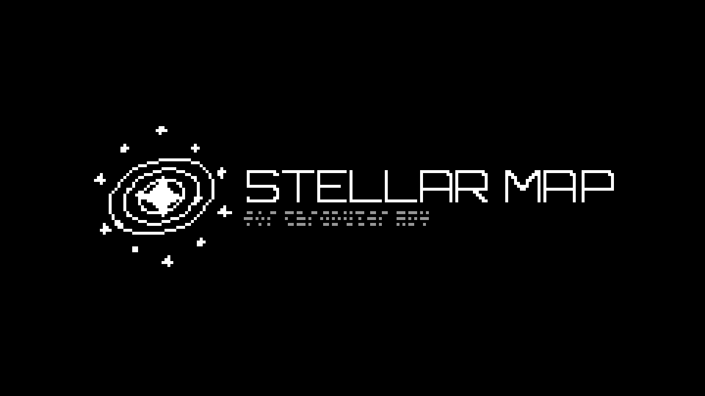
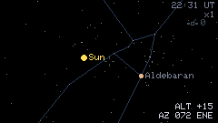
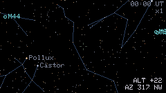
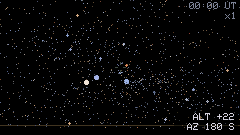
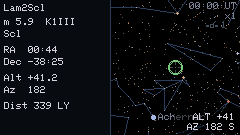
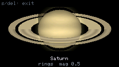

# Stellar Map

a fully offline stellarium inspired planetarium for the **M5Stack Cardputer-ADV** Renders stars visible to the naked eye (mag ≤ 6.5), constellation lines, some planets, and the Moon. Supports CapLora for time and position fix

---



<div>
  
  
  
</div>

---

centered view with detail



saturn scope/simulation




---


## Build

```
git clone https://github.com/wisnc/stellar-map
cd stellar-map
pio run
```

## Config

on initial boot, a `/.stellar_config` file will be created. make sure to edit it with an editor and input your longitude and latitude.

check out [crub](https://github.com/wisnc/crub) for a firmware flasher with a built in editor


## Boot

Prompts for UTC as **`YYMMDDHHMM`** e.g. for May 31 2026 12AM UTC, input `2605310000`

No battery-backed RTC, so the time needs to be re-entered each boot. UTC is also used because it is cleaner, and CapLora retrieves UTC first before your local time since fix takes longer

## Controls


`; , . /` pan (arrow keys) controls AZ and ALT

`= -` to zoom in and out respectively

`r` time rate - 1x 60x 600x 3600x

`l` cycles labels - no label, constellations and planets, all, (if CapLora is available) all + satellites

`s` scope / simulation (still barebones, but simulates what object looks like)

`i` IMU control

`g` GNSS polling toggle (off by default. if CapLora is available, press it to fetch for time and location)

`p` when position is resolved, 'p' below the satellite icon at the top right will be displayed. does nothing when unresolved yet

`t` when time is resolved, 't' below the satellite icon at the top right will be displayed. does nothing when unresolved yet

`enter` to select nearest center object and keeps it centered and shows information panel

`del` dismiss

`space` pause time

`BtnG0` to take a screenshot and save it to /stellar-map/DATETIME_AZ_ALT.bmp in bitmap format

if CapLora is available, be sure to press `g` to start polling for time and location. **keep in mind that the polling will cause Stellar Map to stutter** so toggle it off when satisfied. 

### credits

thanks for HYG database, OpenNGC, and Stellarium modern constellation lines.
